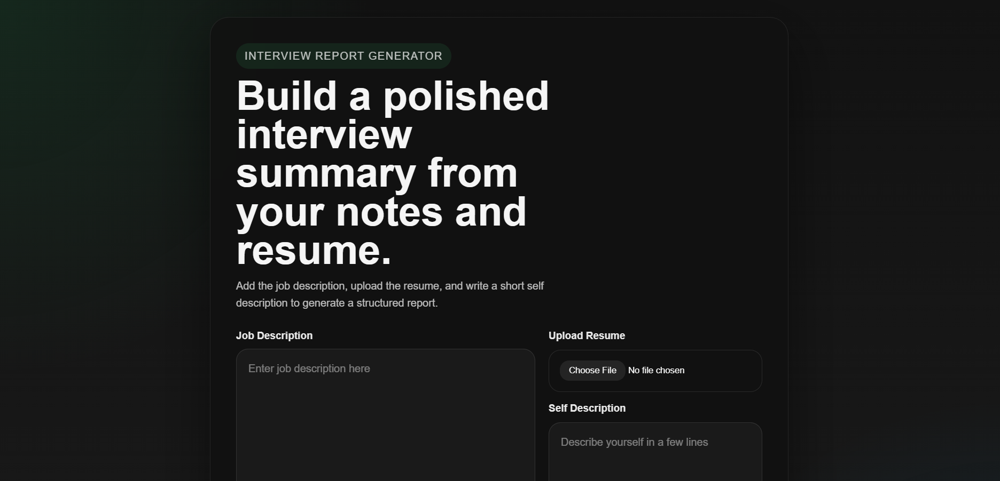

<!-- Banner Section -->
<p align="center">
  
</p>

# 🤖 Interview AI

**Interview AI** is an intelligent, full-stack mock interview and preparation platform designed to help candidates prepare for their target roles. By analyzing a candidate's uploaded resume (PDF), self-description, and target job description, the application leverages the **Google Gemini API** to generate comprehensive, structured feedback reports, identify critical skill gaps, construct custom technical & behavioral questions, formulate study roadmaps, and build downloadable, ATS-friendly tailored resumes.

---

## ✨ Key Features

- **🔐 Secure Authentication**: JWT-based user registration, login, and protected routing.
- **📄 Resume Parse & Analysis**: Automated text extraction from PDF resumes using `pdf-parse`.
- **📊 Compatibility Match Score**: Instant calculation of a percentage match score (0-100%) against the target job description.
- **🧠 Custom Technical & Behavioral Q&As**: Tailored mock questions complete with the interviewer's hidden intentions and detailed guide answers.
- **🎯 Skill Gap Detection**: Identification of missing skills categorized by severity level (`low`, `medium`, `high`).
- **📅 7-Day Actionable Prep Roadmap**: Day-by-day structured learning path customized to fill identified skill gaps and master target topics.
- **📄 Tailored ATS-Friendly Resume PDF Generator**: Custom-tailored HTML resume structured by Gemini and exported directly to a downloadable PDF via `puppeteer`.
- **📂 Historical Reports Dashboard**: Track progress and revisit previous mock interview analysis sessions at any time.

---

## 🛠️ Tech Stack

### Frontend
- **Framework**: [React](https://react.dev/) + [Vite](https://vitejs.dev/)
- **Routing**: [React Router v6](https://reactrouter.com/) (Browser Router)
- **State Management**: React Context API
- **Styling**: SCSS (Sass) for component-level modular styles and utility classes
- **HTTP Client**: [Axios](https://axios-http.com/)

### Backend
- **Runtime**: [Node.js](https://nodejs.org/)
- **Framework**: [Express.js](https://expressjs.com/)
- **Database**: [MongoDB](https://www.mongodb.com/) with [Mongoose ODM](https://mongoosejs.com/)
- **Authentication**: Cookie-based JWT tokens & Bcryptjs password hashing
- **AI Integration**: [Google Gemini SDK (`@google/genai`)](https://github.com/google/generative-ai-js) using `gemini-3-flash-preview`
- **File Parsing**: `multer` (multipart/form-data upload) & `pdf-parse` (PDF text extraction)
- **PDF Engine**: [Puppeteer](https://pptr.dev/) (Headless browser rendering for resume generation)
- **Schema Validation**: [Zod](https://zod.dev/) & `zod-to-json-schema`

---

## 🏗️ Folder Structure

```filepath
interview-ai/
├── Backend/
│   ├── src/
│   │   ├── config/             # DB & server configurations
│   │   │   └── db.js
│   │   ├── controller/         # Request handling logic (Auth & Interview reports)
│   │   │   ├── auth.controller.js
│   │   │   └── interviewController.js
│   │   ├── middlewares/        # JWT auth, File uploads (Multer)
│   │   │   ├── auth.middleware.js
│   │   │   └── file.middleware.js
│   │   ├── models/             # Mongoose schemas (User & InterviewReport)
│   │   │   ├── interviewReport.model.js
│   │   │   └── user.model.js
│   │   ├── routes/             # Router declarations
│   │   │   ├── auth.route.js
│   │   │   └── intervirew.route.js
│   │   ├── services/           # Gemini AI calls & Puppeteer PDF rendering
│   │   │   └── ai.service.js
│   │   └── app.js              # Express app setup & CORS config
│   ├── .env                    # Backend environment configurations
│   ├── server.js               # Entry point
│   └── package.json
├── Frontend/
│   ├── public/                 # Static assets (Favicons, Banner, SVGs)
│   │   └── banner.png
│   ├── src/
│   │   ├── assets/             # Images & static assets
│   │   ├── features/           # Modularized features
│   │   │   ├── Auth/           # Pages & Components for Login & Registration
│   │   │   └── interview/      # Home, Dashboard, Detail page & API services
│   │   │       ├── hooks/      # useInterview custom hook
│   │   │       ├── pages/      # Home.jsx, Interview.jsx
│   │   │       ├── services/   # Axios API endpoints integration
│   │   │       └── interview.context.jsx
│   │   ├── style/              # Global variables, mixins, and stylesheets
│   │   ├── App.jsx
│   │   ├── app.routes.jsx      # React router routing tree
│   │   └── main.jsx
│   ├── package.json
│   └── vite.config.js
└── README.md
```

---

## 🚀 Getting Started

Follow these steps to set up the project locally on your machine.

### Prerequisites
- [Node.js](https://nodejs.org/) (v18 or higher recommended)
- [MongoDB](https://www.mongodb.com/) (Local installation or MongoDB Atlas cluster)
- Google Gemini API Key

---

### Step 1: Clone the Repository
```bash
git clone https://github.com/your-username/interview-ai.git
cd interview-ai
```

---

### Step 2: Configure the Backend

1. Navigate to the `Backend` folder:
   ```bash
   cd Backend
   ```
2. Install dependencies:
   ```bash
   npm install
   ```
3. Create a `.env` file in the `Backend/` directory and configure the environment variables:
   ```env
   MONGODB_URI=your_mongodb_connection_string
   JWT_SECRET=your_jwt_secret_key
   GOOGLE_GEMINI_API_KEY=your_gemini_api_key
   ```
4. Start the backend server in development mode:
   ```bash
   npm run dev
   ```
   *The server runs by default on `http://localhost:3000`.*

---

### Step 3: Configure the Frontend

1. Navigate to the `Frontend` folder:
   ```bash
   cd ../Frontend
   ```
2. Install dependencies:
   ```bash
   npm install
   ```
3. Start the Vite React development server:
   ```bash
   npm run dev
   ```
   *The frontend client runs by default on `http://localhost:5173`.*

---

## 📡 API Reference

### Authentication Endpoints (`/api/auth`)

| Method | Endpoint | Description | Access |
| :--- | :--- | :--- | :--- |
| **POST** | `/register` | Register a new user | Public |
| **POST** | `/login` | Log in user, returns HttpOnly cookie | Public |
| **GET** | `/logout` | Invalidate cookie and logout | Public |
| **GET** | `/get-me` | Get currently logged-in user profile | Private (JWT) |

### Interview Prep Endpoints (`/api`)

| Method | Endpoint | Description | Access |
| :--- | :--- | :--- | :--- |
| **POST** | `/interview` | Upload resume PDF, self description & target job description to generate AI report | Private (JWT) |
| **GET** | `/interview/:interviewId` | Retrieve details for a specific interview report | Private (JWT) |
| **GET** | `/interviews` | Retrieve list of all reports (metadata only) generated by the current user | Private (JWT) |
| **POST** | `/interview/resume/pdf/:interviewReportId` | Generate and download an ATS-optimized, PDF tailored resume | Private (JWT) |

---

## 🤖 Google Gemini Integration

The AI features use the **Google Gemini API** (`gemini-3-flash-preview`) to process multi-format context. 

### Report Schema Structure
To ensure responses are parsed correctly on the frontend, Gemini is forced to output structured JSON data conforming to the following structure:
- **`matchScore`** (`number`): Compatibility score between 0 and 100.
- **`title`** (`string`): Extracted target role title.
- **`technicalQuestions`** (`Array`): Array of objects with `question`, `intention`, and `answer`.
- **`behavioralQuestions`** (`Array`): Array of objects with `question`, `intention`, and `answer`.
- **`skillGaps`** (`Array`): Missing skill tags alongside `severity` level (`low`, `medium`, `high`).
- **`preparationPlan`** (`Array`): Day-by-day (1-7) structured goals and specific tasks.

### Tailored Resume Generation
When downloading the resume:
1. The user's parsed resume, self-description, and target job description are fed to Gemini.
2. The AI generates a clean, custom HTML structure specifically tailored to match the target job description while maintaining an ATS-friendly format.
3. The backend uses **Puppeteer** to spin up a headless browser, render the custom HTML content, and print it to a high-quality A4 PDF format.

